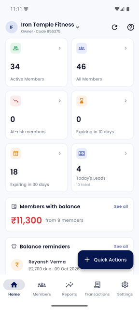
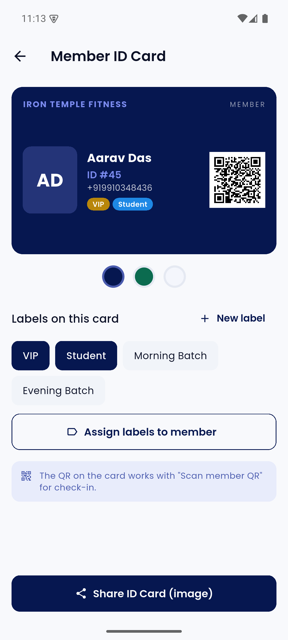
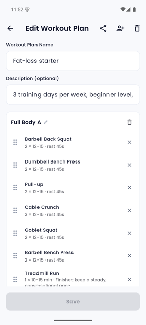
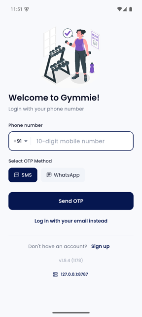
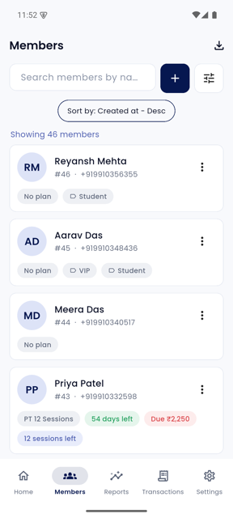
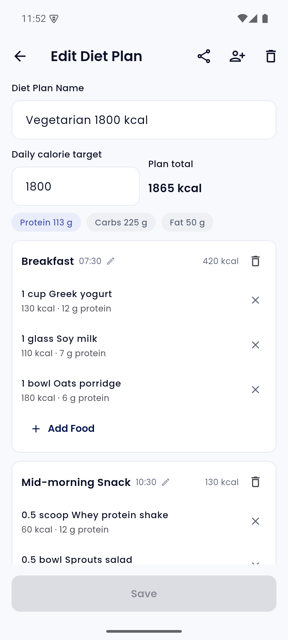
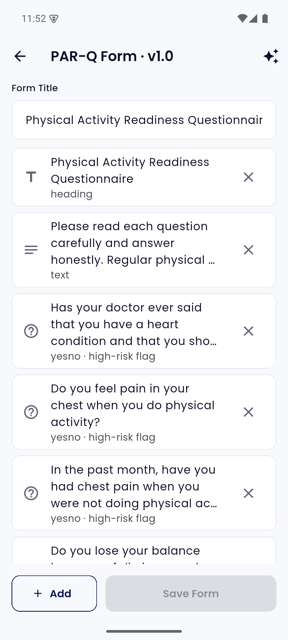
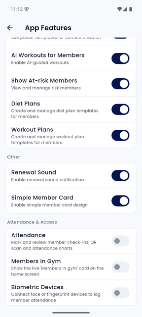
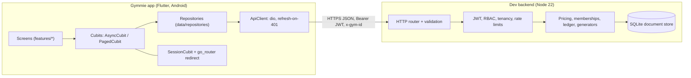

<div align="center">

# Gymmie

**A complete gym-management app for owners, managers, staff and trainers, with a ready-to-run backend.**

Members and memberships · payments and balances · leads · workout and diet plans · PAR-Q health forms · ID cards · broadcasts · reports

[](#release-10)
[](https://flutter.dev)
[](https://dart.dev)
[-3DDC84?logo=android&logoColor=white)](#install-on-a-phone)
[](#1-start-the-backend)
[](#testing)
[](#testing)

 &nbsp;
 &nbsp;


</div>

---

> **Read this first: what this project is.**
> Gymmie is a reconstruction of the Android app *DGymBook Partner 1.9.4*. The original is compiled and obfuscated, so no
> Dart or server source was available. What was **recovered** from the bundle: assets, fonts, animations, the Android
> manifest, UI strings, validation messages, and the list of REST paths. Everything else is **reconstructed**: all Dart
> code and the entire backend were written from that evidence. The backend is a **development** service, **not** the
> original DGymBook production system, and it uses stand-ins for OTP delivery, payments and WhatsApp.
> Details: [Provenance](#provenance-recovered-vs-reconstructed).

## Contents

- [Highlights](#highlights)
- [Screenshots](#screenshots)
- [Quick start](#quick-start)
- [Install on a phone](#install-on-a-phone)
- [Features](#features)
- [Optional modules and admin switches](#optional-modules-and-admin-switches)
- [Roles and permissions](#roles-and-permissions)
- [Architecture](#architecture)
- [Configuration](#configuration)
- [Project structure](#project-structure)
- [Testing](#testing)
- [Building APKs](#building-apks)
- [Provenance (recovered vs reconstructed)](#provenance-recovered-vs-reconstructed)
- [Known gaps](#known-gaps)
- [Security notes](#security-notes)
- [Release 1.0](#release-10)

## Highlights

- **About 100 Flutter source files / 30k lines** covering about 80 screens, with loading, error and empty states and form validation throughout.
- **A full dev backend** (Node 22, zero npm dependencies, SQLite): 278 documented routes, JWT with rotating refresh tokens, role-based permissions, per-gym tenant isolation, rate limiting.
- **Money handled carefully:** server-side price quotes (discount, tax included or excluded), partial payments, balances, settlement, invoices as PDF.
- **Member ID cards** with labels, a check-in QR and share-as-image.
- **Modules that stay out of the way:** attendance, the live "Members in gym" card and biometric devices are **off by default** and an admin switches them on.
- **Honest tooling:** `flutter analyze` is clean, 20 Flutter tests and 38 backend tests pass, and nothing secret is compiled into the app.

## Screenshots

Captured on an Android emulator against the seeded demo gym "Iron Temple Fitness". All names and numbers are fake demo data.

| Login | Home | Members |
|:--:|:--:|:--:|
|  |  |  |

| Member ID card | Workout plan | Diet plan |
|:--:|:--:|:--:|
|  |  |  |

| PAR-Q form builder | App Features (admin switches) |
|:--:|:--:|
|  |  |

## Quick start

You need **Node.js 22.13 or newer** for the backend and **Flutter 3.47 (Dart 3.13)** with the Android SDK for the app.

### 1. Start the backend

```bash
cd backend
node src/seed.js --reset      # creates the demo gym "Iron Temple Fitness"
node src/server.js            # listens on http://0.0.0.0:8787
```

The seed creates 46 members, 323 attendance marks, 10 leads and 6 products. Demo logins (development only, OTP is always `123456`):

| Role | Phone |
|---|---|
| Owner | `+919000000001` |
| Manager | `+919000000002` |
| Trainer | `+919000000003` |
| Staff | `+919000000004` |

In production mode there is no fixed OTP, and the server will not start with any `DEV_*` switch set.

### 2. Run the app

```bash
flutter pub get
flutter run -d <emulator-or-device>
```

A debug build talks to `http://10.0.2.2:8787` by default, which is the host machine as seen from the Android emulator.
On a different network address, change it in the app under the server address on the login screen (*Backend URL*).

## Install on a phone

The release build only accepts HTTPS backends, and the dev backend is plain HTTP. For a physical phone, use the
**debug** build and tunnel the backend over USB:

```bash
cd backend && node src/seed.js --reset && node src/server.js &       # backend on :8787
flutter build apk --debug --target-platform android-arm64 --dart-define=API_BASE_URL=http://127.0.0.1:8787
adb reverse tcp:8787 tcp:8787                                         # phone's 127.0.0.1:8787 -> your computer
adb install -r build/app/outputs/flutter-apk/app-debug.apk
```

Turn on Developer options and USB debugging on the phone first. No cable? Serve the APK over Wi-Fi
(`python3 -m http.server 8000` in the folder holding it), open it in the phone's browser, then set *Backend URL* in the
app to `http://<your-computer-ip>:8787`.

For a build against your own HTTPS backend:

```bash
flutter build apk --release --target-platform android-arm64 --dart-define=API_BASE_URL=https://your-backend.example.com
```

## Features

| Area | What you can do |
|---|---|
| **Auth** | Phone or email login with OTP, registration, gym setup, multi-gym switching, forced update and maintenance screens |
| **Dashboard** | Active, all, at-risk and expiring members, today's leads, balances and reminders, quick reports, rule-based insights, credits |
| **Members** | List with search, filters and sorting, add or edit, detail with tabs, renew or add upcoming membership, upgrade, freeze, extend, end, block, labels, trainer assignment, save contact, member QR |
| **Plans and pricing** | Membership plans and plan groups, session-based plans, live price quote with discount and tax, partial payments, invoice PDF |
| **Finance** | Transactions, member balances, settle dues, balance reminders, expenses, products and sales, tax and payment methods, gym UPI QR |
| **Leads** | Pipeline list, create or edit, snooze, disable, convert to a member with a membership |
| **Fitness** | Exercise library (built-in plus your own), workout and diet plan templates, plan editors, rule-based generators, assign plans to members |
| **Health** | PAR-Q form builder with versions (major or minor), generator by screening area, member signing with a signature pad, risk flags |
| **ID cards** | Member ID card with photo, plan validity, labels and a check-in QR; three colour themes; share as PNG |
| **Communication** | Broadcasts, message templates, credits, history, WhatsApp hand-off, feedback inbox, video links, gym poster |
| **Attendance** *(optional)* | Daily logs, mark attendance, QR scan, week and month charts |
| **Biometrics** *(optional)* | Register face or fingerprint devices, rotate keys, device callback API |
| **Staff** | Staff and roles, trainer schedule, working hours, session bookings |
| **Settings** | Gym details, preferences, features, taxes, payment methods, labels, localisation (English and part of Hindi) |

Feature-by-feature status, including what is not done, is in [`docs/FEATURE_MATRIX.md`](docs/FEATURE_MATRIX.md).

## Optional modules and admin switches

Three modules are **off by default** and are switched on by the owner or a manager under
**Settings → App Features → Attendance & Access**:

| Switch | Controls |
|---|---|
| `ATTENDANCE` | Attendance entry in Settings, the home attendance chart, "Mark attendance" and "Scan member QR" quick actions, the member "Attendance" action |
| `MEMBERS_IN_GYM` | The live "Members in gym" card on the home screen |
| `BIOMETRICS` | Biometric Devices entry and the route |

These switches hide the UI and routes. They are a display preference, **not** an access-control boundary: server
permissions are unchanged. The same flag catalog lives in `assets/feature_flags_data.json` (app) and
`backend/src/feature_flags.json` (server), and a test fails if the two drift apart.

## Roles and permissions

Four roles. The server enforces the matrix in `backend/src/auth.js`; the app mirrors it in `lib/core/auth/permissions.dart`
only to hide actions the server would refuse.

| Area | Owner | Manager | Staff | Trainer |
|---|:--:|:--:|:--:|:--:|
| Members | read, write | read, write | read, write | read |
| Plans | read, write | read, write | read | read |
| Finance (payments, balances) | read, write | read, write | read, write | none |
| Expenses | read, write | read, write | none | none |
| Leads | read, write | read, write | read, write | none |
| Attendance | read, write | read, write | read, write | read |
| Products and sales | read, write | read, write | read, write | none |
| Workout, diet, exercises | read, write | read, write | read | read, write |
| Broadcasts | read, write | read, write | none | none |
| Biometric devices | read, write | read, write | none | none |
| Reports | read | read | read | none |
| Settings | read, write | read, write | read | none |
| Staff management | read, write | read | none | none |

Every gym-scoped request carries `x-gym-id`; the server verifies the caller belongs to that gym before checking the role.

## Architecture



**App.** State is `flutter_bloc` cubits with a generic `AsyncCubit` and `PagedCubit`; dependencies come from `get_it`;
`go_router` redirects on session state (booting, signed out, maintenance, no gym, expired subscription, disabled modules).
The HTTP layer retries once after refreshing an expired access token and keeps tokens in `flutter_secure_storage`.

**Backend.** Plain Node with `node:sqlite` as a tenant-scoped document store, no framework and no npm dependencies.
Access tokens are HS256 JWTs (15 minutes); refresh tokens rotate, and reusing an old one revokes the whole session
family. Pricing, membership status (derived from dates and flags), ledger and the generators live in `backend/src/domain`.

**Contract.** [`docs/API_CONTRACT.md`](docs/API_CONTRACT.md) documents conventions and business rules;
[`docs/API_ROUTES.md`](docs/API_ROUTES.md) is generated from the router (`node backend/scripts/dump-routes.js`).

## Configuration

### App (`--dart-define`)

| Define | Purpose | Default |
|---|---|---|
| `API_BASE_URL` | Backend root (HTTPS required in release builds) | debug: `http://10.0.2.2:8787`; release: none, the app opens *Backend URL* setup |
| `SENTRY_DSN` | Turns on Sentry crash reporting (release builds) | off |
| `FIREBASE_API_KEY`, `FIREBASE_APP_ID`, `FIREBASE_MESSAGING_SENDER_ID`, `FIREBASE_PROJECT_ID`, `FIREBASE_STORAGE_BUCKET` | Turn on Firebase (push token, analytics); all four of key, app id, sender id and project id are required | off |

### Backend (environment variables)

| Variable | Purpose | Default |
|---|---|---|
| `PORT`, `HOST` | Listen address | `8787`, `0.0.0.0` |
| `NODE_ENV` | `production` turns the dev conveniences off: the server **refuses to start** if `DEV_*` switches are set, and requires `JWT_SECRET` | `development` |
| `DB_FILE` | SQLite file | `backend/data/dgymbook-dev.sqlite` |
| `JWT_SECRET` | HS256 secret. In development it is generated into `backend/data/jwt.secret` when unset; **required** in production | generated (dev only) |
| `ACCESS_TTL_SEC`, `REFRESH_TTL_SEC` | Token lifetimes | 900, 2592000 |
| `DEV_FIXED_OTP` | Fixed dev OTP (development only; rejected in production) | `123456` in development, empty in production |
| `CORS_ORIGIN`, `PUBLIC_BASE_URL` | CORS origin and public URL used in links | `*`, empty |
| `RATE_LIMIT_SCALE` | Multiplier for the per-IP request budgets | `1` |
| `MINIMUM_APP_VERSION`, `MINIMUM_SUGGESTED_APP_VERSION` | Drive the forced and suggested update screens | `1.0.0`, `1.9.0` |
| `HELP_CENTER_URL`, `COMPANY_WHATSAPP_NUMBER`, `SIGN_UP_CONTACT_NUMBER`, `SELF_REGISTRATION_PLATFORM` | Values served to the app's settings call | empty |

## Project structure

```
.
├── lib/
│   ├── app/                 # DI, router, session, shell, app widget
│   ├── core/                # config, network, storage, theme, l10n, permissions, shared widgets, utils
│   ├── data/                # models and repositories
│   └── features/            # attendance, auth, dashboard, engagement, fitness, health, leads,
│                            # members, messaging, plans, products, reports, settings, staff,
│                            # system, transactions
├── backend/
│   ├── src/                 # server, auth, db, routes/*, domain/*, seed
│   ├── test/                # 38 end-to-end tests (real HTTP, in-memory DB)
│   └── scripts/             # route dump
├── android/                 # Gradle project (applicationId com.dgymbook.app)
├── assets/                  # fonts, Lottie, posters, sounds, feature flag catalog
├── test/                    # Flutter unit, bloc and catalog tests
├── docs/                    # API contract and routes, build guide, feature matrix, evidence, screenshots
└── tool/                    # toolchain env script and the string-recovery scripts
```

## Testing

```bash
flutter analyze        # no issues
flutter test           # 20 tests: permissions, formatting, API errors, AsyncCubit, models, feature flags
cd backend && npm test # 38 end-to-end tests against a real HTTP server and an in-memory DB
```

The backend tests cover auth and token rotation, pricing and tax rules, memberships (overlap, renew, freeze, extend,
upgrade), balances, leads, attendance, fitness generators, PAR-Q, biometric device callbacks and feature gating.

## Building APKs

`tool/env.sh` is the author's macOS toolchain script (Flutter, JDK 21, Android SDK under `~/development`); copy and adjust it
or use your own setup. On Apple Silicon use the **arm64** Flutter archive: an Intel SDK under Rosetta breaks native-asset
hooks. More detail, including the emulator used for verification, is in [`docs/BUILD.md`](docs/BUILD.md).

```bash
flutter build apk --debug   --target-platform android-arm64 --dart-define=API_BASE_URL=http://127.0.0.1:8787
flutter build apk --release --target-platform android-arm64 --dart-define=API_BASE_URL=https://your-backend.example.com
```

**Signing:** release builds read `android/key.properties` (`storeFile`, `storePassword`, `keyAlias`, `keyPassword`; git-ignored).
Without it the release APK is signed with the **debug key** and Gradle warns. That is fine for sideloading and testing,
and not suitable for the Play Store.

## Provenance (recovered vs reconstructed)

| Area | Status |
|---|---|
| Fonts, Lottie animations, posters, sounds, launcher icons, splash colour | **Recovered** from the bundle |
| Android application id, permissions, intent filters, deep links | **Recovered** |
| UI copy, validation messages, API path inventory, analytics event names, constants | **Recovered** (scrubbed of secrets, in `docs/evidence/`) |
| Screens, layouts, navigation, state management, models, all Dart code | **Reconstructed** from the above |
| Backend (`backend/`) and its contract | **Reconstructed** development stand-in |

The recovery scripts (`tool/evidence/`) parse the Dart AOT string table; they are included so the evidence is reproducible.
Secrets found inside the original APK (analytics keys, Sentry DSN, Firebase client config) were deliberately **not** copied.
No attempt was made to probe the original production service.

**Development stand-ins in the backend:** OTP delivery (fixed dev OTP), payment provider, WhatsApp and SMS outbox (nothing is
sent), rule-based workout, diet and PAR-Q generators (labelled rule-based, not AI), and the biometric device API (no device is attached).

### What is deliberately unchanged from the original

The Android application id `com.dgymbook.app`, the `dgymbook://` deep-link and QR scheme, and the Dart package name
`gym_book_app` stay as they are, so existing installs, printed QR codes and links keep working.

## Known gaps

- Report-schedule settings page
- Handler for the `dgymbook://payments` deep link (the manifest filter exists)
- Push notification registration (needs a real Firebase project; the endpoint exists)
- `view-photo` route
- Localisation is English plus part of Hindi
- The member PAR-Q signing flow was not exercised end to end on a device

## Security notes

- No production credentials, endpoints or keys are in this repository; the original hosts are shown only as presets in the app's Developer tools and are never selected automatically.
- Production mode refuses to start with the fixed dev OTP or dev payments enabled, and requires a real `JWT_SECRET`; the app only allows cleartext HTTP in **debug** builds.
- Hiding a module with an admin switch does not change server authorization.
- The dev database and JWT secret live in `backend/data/` and are git-ignored.
- There is no `LICENSE` file yet. Until one is added, all rights are reserved by default.

## Release 1.0

**Gymmie 1.0** is the first public release. Highlights and the full change list are in
[`docs/RELEASE_NOTES_v1.0.md`](docs/RELEASE_NOTES_v1.0.md) and [`CHANGELOG.md`](CHANGELOG.md).
The in-app version stays at `1.9.4+1178`, the reconstruction base, so Android treats new builds as updates of earlier installs.

Release assets (attached to the GitHub release; not stored in the repository):

| File | For |
|---|---|
| `gymmie-1.0-debug-usb.apk` | Phones and emulators, backend reached through `adb reverse` (`http://127.0.0.1:8787`) |
| `gymmie-1.0-release-arm64.apk` | Phones, against an HTTPS backend (set it in Developer tools). Signed with the debug key |
