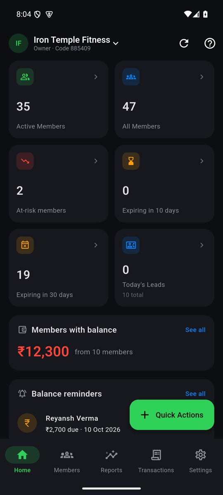
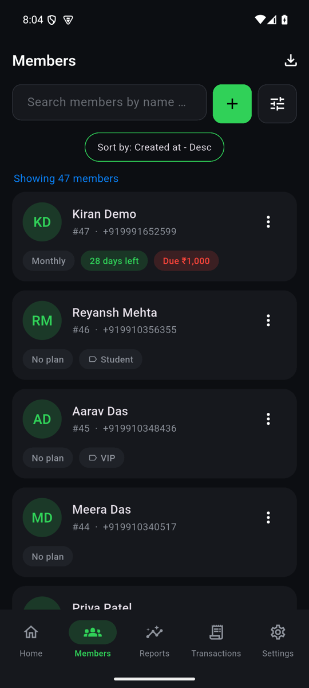
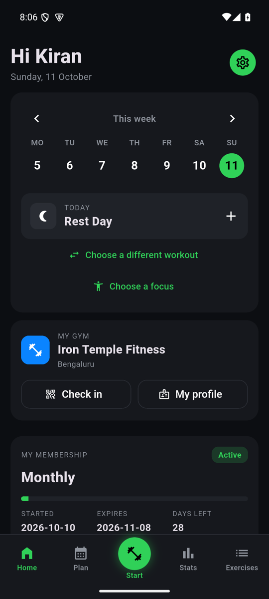
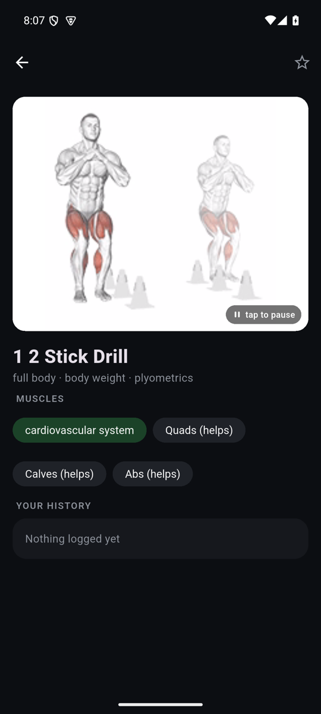
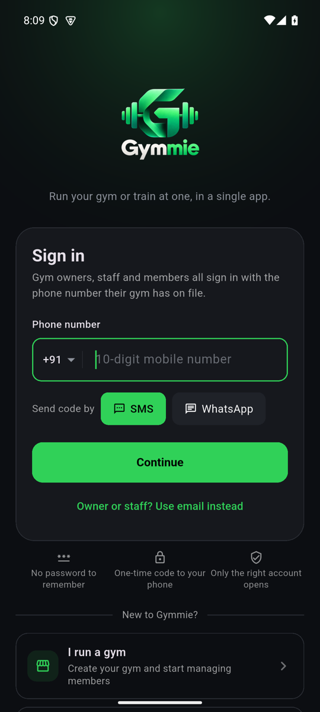
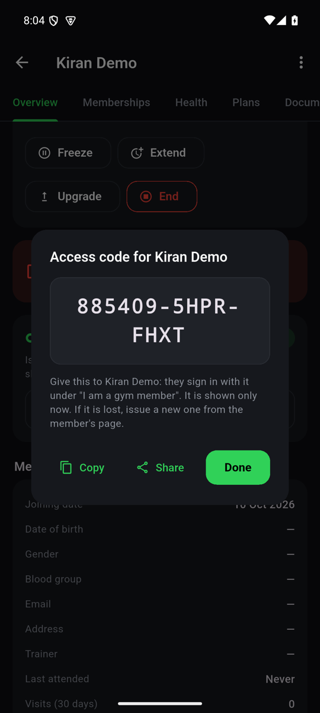
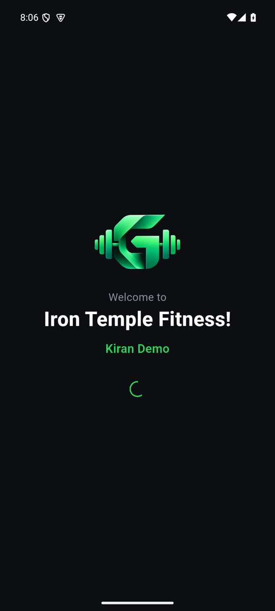
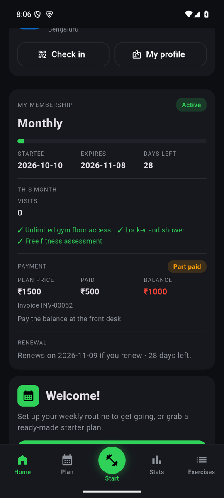
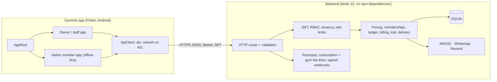

<div align="center">


# Gymmie 2.0

**Run your gym, or train at one, in a single app.**

Gymmie is a gym-management app for owners, managers, staff and trainers, with a native member app, and a small
self-hostable backend that handles billing, messages and backups.

[](CHANGELOG.md)
[](LICENSE)
[](https://flutter.dev)
[](#install-the-app)
[](#1-start-the-backend)
[](#testing)
[](#testing)

<br>

 &nbsp;
 &nbsp;
 &nbsp;


</div>

---

## What it is

| For | What they get |
|---|---|
| **Owners and managers** | Members and memberships, plans and pricing, payments and dues, leads, expenses, products, reports, broadcasts, staff and roles, a 14-day free trial, then a subscription. |
| **Staff and trainers** | The day-to-day desk: add and renew members, record payments, mark attendance, build workout and diet plans, collect PAR-Q health forms. Trainers see only their own members. |
| **Members** | A native training log (plan, live workout, history, stats, 5,632-exercise library with animations), their membership at a glance, check-in QR, account and privacy controls. |
| **The person who runs the service** | A zero-dependency Node + SQLite backend with Razorpay billing, SMS / WhatsApp / email delivery, nightly verified backups and an operator console. |

Gymmie is free software under the **AGPL-3.0**. The code is open; what is charged for is the hosted service, support and
message credits. See [NOTICE.md](NOTICE.md) for the work Gymmie builds on.

## What is new in 2.0

- **Member app.** A native Flutter app (offline-first, no WebView) ported from openGym, with *My gym*: membership, expiry,
  visits, balance, renewal, check-in QR.
- **One sign-in.** Phone number plus a one-time code for everyone; the server says whether the number is staff, a member or
  both. Members can also sign in with an **access code** the gym issues, re-issues or revokes.
- **Launch flow.** Animated logo, a skippable walkthrough invitation, a 14-day trial that starts when setup is done, and an
  optional "collect fees online" step.
- **Real money.** Subscription plans enforced on the server, Razorpay payment links with a signed idempotent webhook, GST
  invoices, referral rewards, message-credit packs. A gym can also connect **its own** Razorpay account to collect member fees.
- **Real delivery.** Sign-in codes and gym messages by SMS (MSG91), WhatsApp (Cloud API) and email (Resend); failed messages
  return their credit.
- **Exercise animations** that play as in openGym, in both the member and the owner app.
- **One look.** The owner app now shares the member app's palette, accent and components.
- **Operations.** Dockerfile, Caddy with automatic HTTPS, nightly verified backups, `/ready`, graceful shutdown, JSON logs, CI.
- **A clean identity.** New logo and launcher icon, application id `app.gymmie.android`, AGPL-3.0, recovered third-party
  assets removed.

The complete list is in [CHANGELOG.md](CHANGELOG.md).

## Screenshots

Captured on an Android emulator against a demo gym ("Iron Temple Fitness"). All names and numbers are fake.

| Sign in | Owner home | Members |
|:--:|:--:|:--:|
|  |  |  |
| One sign-in for owners, staff and members | Dashboard with at-risk members, expiries and dues | Search, filters, balances and plan status |

| Access code | Welcome | Member home |
|:--:|:--:|:--:|
|  |  |  |
| The gym issues a code, shown once | "Welcome to your gym!" | Week strip, today's routine, *My gym* |

| Membership | Exercise animation |
|:--:|:--:|
|  |  |
| Plan, status, days left, payment and renewal | Animated demonstrations for 5,632 exercises |

## Install the app

**Download:** the APK is attached to the [release](../../releases) (64-bit Android 7.0 or newer). Allow installs from your
browser or file manager when Android asks.

> The attached APK is a **test build**: it is signed with a debug key and is not for the Play Store. It has no backend
> address built in, so on first start it asks for the HTTPS address of **your** backend (see
> [docs/DEPLOY.md](docs/DEPLOY.md)). For your own branded build, see [Building the app](#building-the-app) and
> [docs/RELEASE.md](docs/RELEASE.md).

## Quick start (developers)

You need **Node.js 22.13+** for the backend and **Flutter 3.47 (Dart 3.13)** with the Android SDK for the app.

### 1. Start the backend

```bash
cd backend
node src/seed.js --reset      # creates the demo gym "Iron Temple Fitness"
node src/server.js            # listens on http://0.0.0.0:8787
```

The seed creates 46 members, attendance, 10 leads and 6 products. Demo logins (development only; the OTP is always `123456`):

| Role | Phone |
|---|---|
| Owner | `+919000000001` |
| Manager | `+919000000002` |
| Trainer | `+919000000003` |
| Staff | `+919000000004` |

In production mode there is no fixed OTP, and the server will not start with any `DEV_*` switch set.

To try the member app, open a member's page as the owner, choose **Issue access code**, then use **I am a gym member** on the
sign-in screen.

### 2. Run the app

```bash
flutter pub get
flutter run -d <emulator-or-device>
```

A debug build talks to `http://10.0.2.2:8787` by default (the host machine, as seen from the Android emulator). Use the
server address on the sign-in screen to point it elsewhere.

### 3. On a physical phone

The release build only accepts HTTPS backends, and the dev backend is plain HTTP, so use a **debug** build and tunnel the port:

```bash
flutter build apk --debug --target-platform android-arm64 --dart-define=API_BASE_URL=http://127.0.0.1:8787
adb reverse tcp:8787 tcp:8787
adb install -r build/app/outputs/flutter-apk/app-debug.apk
```

## Features

| Area | What you can do |
|---|---|
| **Sign-in** | One screen for everyone, phone or email with a one-time code, access-code login for members, multi-gym switching, forced-update and maintenance screens |
| **Dashboard** | Active, all, at-risk and expiring members, today's leads, balances and reminders, quick reports, insights, credits |
| **Members** | Search, filters and sort, add or edit, detail tabs, renew or add an upcoming membership, upgrade, freeze, extend, end, block, labels, trainer assignment, member QR, access code |
| **Plans and pricing** | Plans and groups, session-based plans, live price quote with discount and tax, partial payments, invoice PDF |
| **Finance** | Transactions, balances, settle dues, balance reminders, expenses, products and sales, tax and payment methods, gym UPI QR, online fee collection |
| **Leads** | Pipeline, snooze, disable, convert to a member with a membership |
| **Fitness** | Exercise library (5,632 built in, plus your own), workout and diet templates, rule-based generators, assign plans to members, exercise animations |
| **Health** | PAR-Q form builder with versions, generator by screening area, member signing with a signature pad, risk flags |
| **ID cards** | Photo, plan validity, labels and a check-in QR, three colour themes, share as image |
| **Communication** | Broadcasts, templates, credits, history, WhatsApp hand-off, feedback inbox, video links, gym poster |
| **Attendance** *(optional)* | Daily logs, mark attendance, QR scan, week and month charts |
| **Biometrics** *(optional)* | Register face or fingerprint devices, rotate keys, device callback API |
| **Staff** | Staff and roles, trainer schedule, working hours, session bookings |
| **Member app** | Plan, live workout with rest timer, history, stats and activity heatmap, library, "Choose a focus" body map, reminders, backup export and import, profile and photo, signed-in devices, privacy controls, membership requests, account deletion |
| **Settings** | Gym details, preferences, features, taxes, payment methods, labels, billing and plan, online payments, localisation (English and part of Hindi) |

Status feature by feature, including what is not done, is in [docs/FEATURE_MATRIX.md](docs/FEATURE_MATRIX.md) and
[docs/MEMBER_APP.md](docs/MEMBER_APP.md).

### Roles and permissions

Four staff roles, enforced by the server (`backend/src/auth.js`); the app mirrors the matrix only to hide actions the server
would refuse. Members are a separate principal with their own tokens and routes.

| Area | Owner | Manager | Staff | Trainer |
|---|:--:|:--:|:--:|:--:|
| Members | read, write | read, write | read, write | read (own members) |
| Plans | read, write | read, write | read | read |
| Finance (payments, balances) | read, write | read, write | read, write | none |
| Expenses | read, write | read, write | none | none |
| Leads | read, write | read, write | read, write | none |
| Attendance | read, write | read, write | read, write | read |
| Products and sales | read, write | read, write | read, write | none |
| Workout, diet, exercises | read, write | read, write | read | read, write |
| Broadcasts | read, write | read, write | none | none |
| Biometric devices | read, write | read, write | none | none |
| Reports | read | read | read | none |
| Settings and billing | read, write | read, write | read | none |
| Staff management | read, write | read | none | none |

Every gym-scoped request carries `x-gym-id`; the server checks the caller belongs to that gym before it checks the role.

### Optional modules

Three modules are **off by default** and switched on by an owner or manager under **Settings → App Features**:
`ATTENDANCE`, `MEMBERS_IN_GYM` and `BIOMETRICS`. Plan-based add-ons are enforced on the server. The feature catalogue lives in
`assets/feature_flags_data.json` (app) and `backend/src/feature_flags.json` (server); a test fails if they drift apart.

## Architecture



- **App.** `flutter_bloc` cubits with a generic `AsyncCubit` and `PagedCubit`, `get_it`, `go_router`. `AppRoot` shows the
  member app when a member session exists and the staff app otherwise. The owner and member apps share one palette (`OGPalette`).
  Tokens live in `flutter_secure_storage`; an expired access token is refreshed once and the request retried.
- **Member app.** Training logic is pure Dart under `lib/features/member/native/domain/`, checked against openGym's own
  JavaScript in golden tests. A local-first store syncs one revisioned JSON document per member.
- **Backend.** Plain Node with `node:sqlite` as a tenant-scoped store. HS256 JWTs (15 minutes), rotating refresh tokens
  (reuse revokes the family), separate member principal. Subscription state (active, grace, locked) is derived on the server
  and enforced on every request.
- **Contract.** [docs/API_CONTRACT.md](docs/API_CONTRACT.md) for conventions and business rules;
  [docs/API_ROUTES.md](docs/API_ROUTES.md) is generated from the router (`node backend/scripts/dump-routes.js`).

## Configuration

### App (`--dart-define`)

| Define | Purpose | Default |
|---|---|---|
| `API_BASE_URL` | Backend root (HTTPS required in release builds) | debug: `http://10.0.2.2:8787`; release: none, the app asks |
| `SENTRY_DSN` | Crash reporting (release builds) | off |
| `FIREBASE_API_KEY`, `FIREBASE_APP_ID`, `FIREBASE_MESSAGING_SENDER_ID`, `FIREBASE_PROJECT_ID`, `FIREBASE_STORAGE_BUCKET` | Firebase (push token, analytics); key, app id, sender id and project id are all required | off |
| `OPENGYM_SOURCE_URL` | Where the in-app notices point for the source code (AGPL §13) | empty |

### Backend (environment variables)

The full, commented list is in [`deploy/.env.example`](deploy/.env.example).

| Variable | Purpose |
|---|---|
| `NODE_ENV=production` | Turns dev conveniences off; refuses to start with `DEV_*` switches or without `JWT_SECRET` |
| `JWT_SECRET` | HS256 secret (`openssl rand -hex 32`); required in production |
| `DB_FILE`, `PORT`, `HOST` | SQLite file and listen address |
| `PUBLIC_BASE_URL`, `CORS_ORIGIN`, `TRUST_PROXY` | Public URL, browser origin allow-list, number of reverse proxies in front |
| `RAZORPAY_KEY_ID`, `RAZORPAY_KEY_SECRET`, `RAZORPAY_WEBHOOK_SECRET` | Gymmie's own subscription and credit sales |
| `PLATFORM_LEGAL_NAME`, `PLATFORM_GSTIN`, `PLATFORM_ADDRESS` | Printed on Gymmie's GST invoices |
| `SMS_PROVIDER`, `MSG91_*` | SMS (needs DLT-registered templates in India) |
| `WHATSAPP_*` | WhatsApp Cloud API (approved templates) |
| `RESEND_API_KEY`, `EMAIL_FROM` | Email codes |
| `SUBSCRIPTION_GRACE_DAYS`, `PRICING_FILE` | Read-only days after the plan ends; override the plan and pack prices |
| `OPENGYM_PUBLIC_URL`, `OPENGYM_API_URL`, `OPENGYM_SSO_SECRET`, `EXERCISE_MEDIA_LICENSED` | Exercise pictures host and the licence switch, see [NOTICE.md](NOTICE.md) |
| `COMPANY_WHATSAPP_NUMBER`, `SUPPORT_EMAIL`, `SUPPORT_NAME`, `HELP_CENTER_URL` | Contact shown once to new owners; empty shows none, nothing is invented |

Without the provider variables the backend runs in **development mode**: fixed OTP, a fake payment page and an outbox that
records messages instead of sending them.

## Going live

| Step | Guide |
|---|---|
| Run the backend: Docker, Caddy (HTTPS), nightly verified backups, monitoring | [docs/DEPLOY.md](docs/DEPLOY.md) |
| Sign and publish the app: keystore, R8, Play Console, checklist | [docs/RELEASE.md](docs/RELEASE.md) |
| Pricing, pilot gyms, what to measure | [docs/GO_TO_MARKET.md](docs/GO_TO_MARKET.md) |
| Privacy policy, terms and account-deletion page (drafts for a lawyer to review) | [docs/legal/](docs/legal/) |
| Operator console: list gyms, grant plans or credits, revenue | `node backend/scripts/admin.js` |

## Project structure

```
.
├── lib/
│   ├── app/                 # DI, router, session, shell, app root
│   ├── core/                # config, network, storage, theme, l10n, permissions, shared widgets
│   ├── data/                # models and repositories
│   └── features/            # staff features (members, plans, finance, leads, fitness, health, ...)
│                            # and member/ (native member app, domain, UI, sync)
├── backend/
│   ├── src/                 # server, auth, db, routes/*, domain/*, payments, messenger
│   ├── test/                # end-to-end tests (real HTTP, in-memory DB)
│   └── scripts/             # admin console, backup, restore check, route dump
├── deploy/                  # Caddyfile, docker-compose, .env.example
├── member-app/              # openGym source the member app was ported from (AGPL-3.0)
├── android/                 # Gradle project (applicationId app.gymmie.android)
├── assets/                  # brand, fonts, Lottie, sounds, feature-flag catalogue
├── test/                    # Flutter unit, bloc, golden and widget tests
├── docs/                    # contract, routes, deploy, release, legal drafts, screenshots
└── .github/workflows/       # CI: backend tests, analyze, Flutter tests, signed bundle on tag
```

## Testing

```bash
flutter analyze                # no issues
flutter test                   # 202 tests: domain parity with openGym, member UI, permissions, models, flags
cd backend && npm test         # 129 end-to-end tests against a real HTTP server and an in-memory DB
```

The backend tests cover auth and token rotation, the member principal and access codes, pricing and tax, memberships (overlap,
renew, freeze, extend, upgrade), balances, billing and the trial, signed webhooks (valid, forged, replayed), delivery and
credit refunds, exercise-media licensing, operations (backup, readiness) and feature gating.

## Building the app

`tool/env.sh` is the author's macOS toolchain script (Flutter, JDK 21, Android SDK under `~/development`); copy and adjust it.
On Apple Silicon use the **arm64** Flutter archive. More detail in [docs/BUILD.md](docs/BUILD.md).

```bash
# debug, against a local backend
flutter build apk --debug --target-platform android-arm64 --dart-define=API_BASE_URL=http://127.0.0.1:8787

# release, against your HTTPS backend (reads android/key.properties; git-ignored)
flutter build appbundle --release --dart-define=API_BASE_URL=https://api.example.com

# local release test without a key (never upload this)
flutter build apk --release --target-platform android-arm64 -PallowDebugSigning=true \
  --dart-define=API_BASE_URL=https://api.example.com
```

Release builds are minified and **refuse to be signed with the debug key** unless you pass `-PallowDebugSigning=true`.

## Known gaps

- Push notifications (FCM) are not wired; reminders and notices go by WhatsApp, SMS and local notifications.
- No iOS build.
- Localisation is English plus part of Hindi.
- Exercise pictures and animations are **not** bundled: their licence is openGym-only. They show when the operator holds a
  licence and sets `EXERCISE_MEDIA_LICENSED=1`; otherwise the library works as text and body-map filters.
- Member-app features not yet ported from openGym are listed in [docs/MEMBER_APP.md](docs/MEMBER_APP.md).
- A single backend instance only: rate limits and schedulers live in the process.

## Security

- No credentials, endpoints or keys are in this repository; `deploy/.env`, keystores and `google-services.json` are git-ignored.
- Production mode refuses the fixed dev OTP and dev payments, and requires a real `JWT_SECRET` and a webhook secret.
- Gym Razorpay keys are sealed at rest with AES-GCM; access codes are stored only as HMAC hashes and shown once.
- Hiding a module with an admin switch is a display choice; server permissions are what protect data.
- Report a vulnerability privately to the maintainer instead of opening a public issue.

## Licence and credits

Gymmie is licensed under the **GNU Affero General Public License v3.0 or later** ([LICENSE](LICENSE)).
`member-app/opengym/` is a separate work under the same licence; see [member-app/README.md](member-app/README.md).

Built on and with thanks to **openGym** (Duarte Santos, AGPL-3.0), **GymMane** (InlitX, GPL-3.0 with attribution:
*Based on GymMane by InlitX*), **MuscleMap** (MIT), **ExerciseDB** data (MIT) and **Poppins** (OFL). Details in
[NOTICE.md](NOTICE.md).
